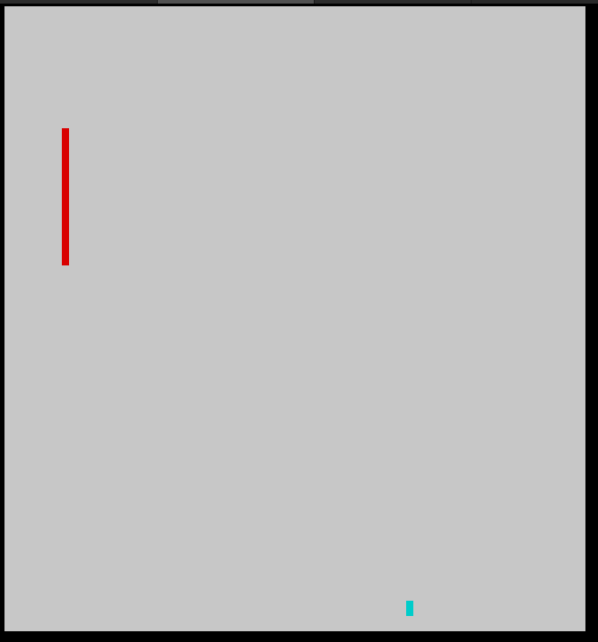

# Snake

Snake in the terminal, built with Go and termbox. This was a learning exercise but I'm pretty satisfied with it (aside from the graphics). The only thing I'm concerned about is storing a reference to the world on each object as well as a reference to each object on the world. It makes initializing the world a bit more fiddly than it should be.

